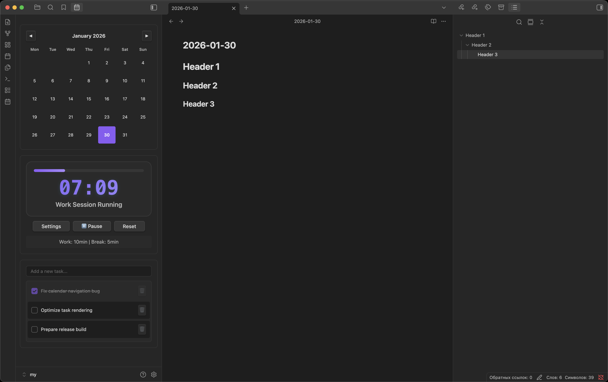
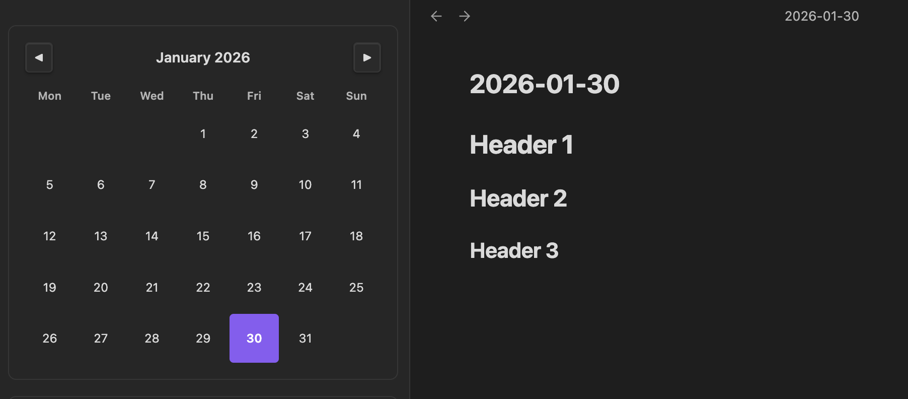
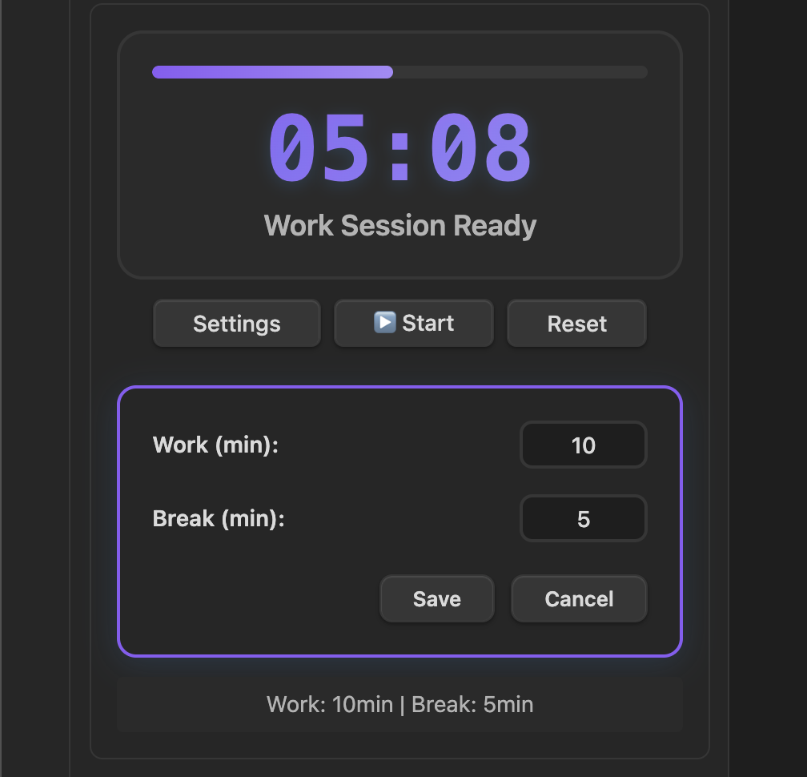
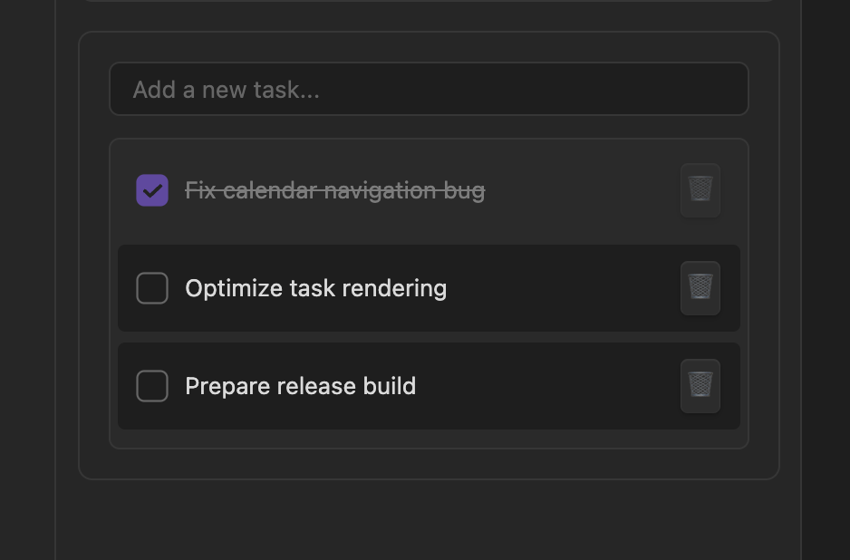

# Deadline

**Deadline** is an all-in-one productivity plugin for **Obsidian** that combines a calendar, Pomodoro timer, and task manager into a single, clean workspace view.

It is designed to help you plan your day, stay focused, and manage tasks without switching between multiple plugins.

---

## ✨ Features 

### 📅 Calendar
- Monthly calendar view
- Easy navigation between months
- Click any date to create or open a daily note  
- Daily notes use the format: `YYYY-MM-DD.md`
- Automatically highlights today
- Opens daily notes in a new tab

### ⏱️ Pomodoro Timer
- Default **40-minute work** and **5-minute break** sessions
- Fully customizable work and break durations
- Large, clear time display (MM:SS)
- Animated progress bar
- Status indicators: Ready / Running / Complete
- Sound notification on completion
- Automatically resets after finishing

### 📋 Task Manager
- Quickly add tasks with Enter key
- Checkbox-based task list
- Mark tasks as completed or active
- Delete tasks individually
- Clear empty-state messaging
- Visual distinction for completed tasks

### 🎨 Design & UX
- Native Obsidian look and feel
- Fully compatible with light and dark themes
- Smooth animations and transitions
- Responsive layout for different panel sizes
- Uses Obsidian CSS variables for full theme support

---

## 🖼️ Screenshots
- Main plugin view 
 
- Calendar interaction  

- Pomodoro timer in action  

- Task manager overview  

---

## 📦 Installation

### Method 1: Community Plugins (Recommended)
1. Open **Settings → Community Plugins**
2. Disable **Safe Mode**
3. Click **Browse**
4. Search for **Deadline**
5. Click **Install** → **Enable**

### Method 2: Manual Installation
1. Download the latest release from  
   👉 https://github.com/Saydullayev017/deadline/releases
2. Extract the files into:
   ```
   ~/.obsidian/plugins/deadline/
   ```
3. Restart Obsidian
4. Enable **Deadline** in **Settings → Community Plugins**

---

## ▶️ Opening the Plugin

You can open Deadline using:
- **Command Palette** → `Open Deadline`
- Ribbon icon (if enabled)

---

## ⚙️ Configuration

### Default Settings
- Work duration: **40 minutes**
- Break duration: **5 minutes**
- Daily note format: `YYYY-MM-DD.md`

### Customization
All UI elements follow Obsidian’s theme variables, ensuring compatibility with:
- Light and dark themes
- Custom color schemes
- Font and scaling preferences

---

## 📁 File Structure

```
deadline/
 ├── main.js
 ├── manifest.json
 ├── styles.css
 └── README.md
```

---

## 🧪 Troubleshooting

### Plugin Not Loading
- Ensure the plugin is enabled
- Restart Obsidian
- Check the developer console for errors

### Calendar Not Creating Files
- Verify vault permissions
- Ensure files with the same name do not already exist

### Timer Issues
- Disable conflicting plugins
- Reset plugin settings
- Restart Obsidian

### Task Persistence
- Tasks are currently stored per session  
- Persistent task storage is planned for future versions

---

## 🗺️ Roadmap
- Persistent task storage
- Multiple Pomodoro presets
- Custom daily note templates
- Productivity statistics
- Import / export support

---

## 📄 License

MIT License — free for personal and commercial use.

---

## 🤝 Contributing

Contributions, issues, and feature requests are welcome.  
Please open an issue or submit a pull request on GitHub.

---

## ❤️ Support

If you find **Deadline** useful:
- ⭐ Rate it in the Obsidian Community Plugins browser
- 🐛 Report bugs or issues
- 💡 Suggest new features

---

**Built with ❤️ for the Obsidian community.**
